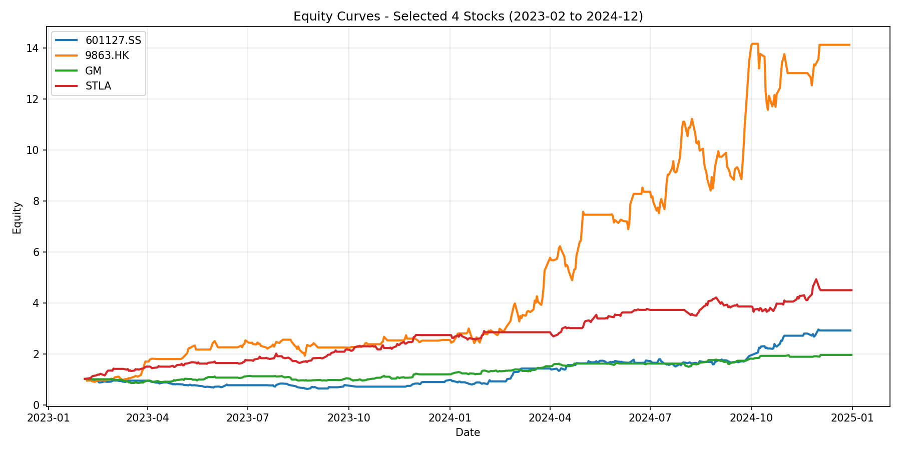

# Hybrid Transfer Learning for EV Stock Return Prediction

Reference implementation for the ICAIF paper on EV stock return prediction with
path signatures and transfer learning.

## Overview

This repository predicts daily log-return changes for EV-related stocks using
path signature features built from OHLCV windows. Earlier-listed stocks are
used as source tasks and later-listed stocks are treated as target tasks.

Three experiment entry points are included:

| Script | Source model | Transfer penalty | Notes |
| --- | --- | --- | --- |
| `experiments/run_ridge.py` | Ridge | L2 | Ridge transfer experiment |
| `experiments/run_lasso.py` | Lasso | L1 | Lasso transfer experiment |
| `experiments/run_ridge_lasso.py` | Ridge | L1 | Hybrid setting from the paper |

Transfer risk is reported with a Wasserstein-based measure computed from the
source prediction and target test distribution.

## Research Setup

The project follows the EV-sector forecasting setup described in the paper and
presentation materials:

- Universe: 24 listed EV-related firms across the U.S., Mainland China, and
  Hong Kong markets.
- Start date per stock: the later of IPO date and January 1 of the year before
  the firm's first EV release.
- Main evaluation split: training through `2023-12-31`, testing on
  `2024-01-01` to `2024-12-31`.
- Source/target idea: earlier-listed firms provide source-task information for
  later-listed firms with shorter histories.
- Feature grid used in experiments: lag length `L in {2, 3, 5, 10}` and
  signature depth `M in {2, 3, 4}`.

## Method Sketch

For each `(lag, depth)` pair:

1. Pre-processing
   Build path signature features from rolling OHLCV windows.
   Build the target series from differenced log-close.
   Standardize train and test splits separately.
2. Source pre-training
   Fit a Ridge or Lasso source model on pooled source-company training data.
3. Target adaptation
   Optimize the transfer-learning objective with `scipy.optimize.minimize`.
4. Evaluation
   Save direct-learning metrics, transfer-learning metrics, transfer risk, and
   coefficient vectors.

## Repository Structure

```text
hybrid-transfer-learning/
|-- src/
|   |-- data.py
|   |-- transfer.py
|   |-- evaluation.py
|   `-- __init__.py
|-- experiments/
|   |-- config.py
|   |-- run_ridge.py
|   |-- run_lasso.py
|   `-- run_ridge_lasso.py
|-- backtest/
|   |-- strategy.py
|   `-- __init__.py
|-- data/
|   `-- README.md
|-- requirements.txt
`-- .gitignore
```

## Installation

```bash
pip install -r requirements.txt
```

`iisignature` may require a compiler toolchain. On Windows, using a binary
wheel is usually the easiest option:

```bash
pip install iisignature --prefer-binary
```

## Data Setup

1. Put `start_dates.xlsx` in `data/`.
2. Put one CSV per ticker in `data/`, for example `GM.csv`, `STLA.csv`.
3. Make sure the files match the format described in
   [data/README.md](data/README.md).

For local testing and benchmarking, this repository also includes
`data/sample(start_dates).xlsx`, which matches the 24-stock sample used in the
research workflow.

## Running Experiments

From the project root:

```bash
python experiments/run_ridge.py
python experiments/run_lasso.py
python experiments/run_ridge_lasso.py
```

Shared paths and hyperparameters live in
[experiments/config.py](experiments/config.py).

Excel outputs are written to the project root.

## Backtest

`backtest/strategy.py` provides a rolling walk-forward backtest utility built
around the same preprocessing and transfer-learning pipeline.

Example:

```python
import pandas as pd
from sklearn.linear_model import Ridge

from src.data import load_data, precompute_signatures
from src.transfer import pre_trained_ridge, lasso_transfer_coef
from backtest.strategy import (
    run_backtest,
    build_prediction_df,
    add_prediction_intervals,
    plot_strategy,
)

sig_cache = precompute_signatures(data_frames, start_dates, lags=[2], depths=[2])
date_range = pd.date_range("2024-01-01", "2024-11-30", freq="MS")

backtest = run_backtest(
    start_dates,
    data_frames,
    sig_cache,
    date_range,
    lag=2,
    depth=2,
    lambda_S=0.0001,
    lambda_T=0.0005,
    p=2,
    source_trainer=pre_trained_ridge,
    target_adapter=lasso_transfer_coef,
    direct_model_cls=Ridge,
)

graph = build_prediction_df(backtest, "GM", date_range)
graph = add_prediction_intervals(graph, date_range)
plot_strategy("GM", data_frames, graph, date_range)
```

## Benchmark

Using the 24-stock sample in `sample(start_dates).xlsx` together with the
corresponding daily CSV files, the current implementation was benchmarked on a
1-year walk-forward backtest over `2024-01-01` to `2024-12-01` with monthly
retraining, `lag=2`, and `depth=2`.

### Runtime

| Task | Runtime |
| --- | ---: |
| Full backtest with signatures recomputed each month | `274.994 s` |
| Cached-signature backtest with `precompute_signatures()` | `122.482 s` |
| Backtest speedup | `2.25x` |

For the Ridge transfer adapter alone:

| Solver Variant | Runtime |
| --- | ---: |
| Generic `minimize` from zero initialization | `5.9654 s` |
| Warm-started `minimize` with analytical gradient | `0.0063 s` |
| Adapter speedup | `948.95x` |

The maximum parameter difference observed in that Ridge-transfer comparison was
`0.0011961806`.

### 1-Year Backtest Metrics

Hybrid Ridge-Lasso strategy results for the 15 target stocks in the sample:

| Stock | Cumulative Return | Annualized Return | Max Drawdown | Sharpe |
| --- | ---: | ---: | ---: | ---: |
| `0305.HK` | `3.669941` | `4.078289` | `-0.239667` | `2.612789` |
| `9863.HK` | `3.180767` | `3.490749` | `-0.250657` | `2.343497` |
| `000800.SZ` | `2.760536` | `3.018021` | `-0.127193` | `3.640115` |
| `601127.SS` | `2.362377` | `2.591637` | `-0.161152` | `2.768230` |
| `XPEV` | `2.185129` | `2.214786` | `-0.264772` | `1.917591` |
| `LI` | `2.076708` | `2.104495` | `-0.258687` | `1.980200` |
| `601633.SS` | `1.507207` | `1.635746` | `-0.092847` | `2.895442` |
| `VWAGY` | `1.579047` | `1.598669` | `-0.168850` | `2.697837` |
| `0175.HK` | `0.969113` | `1.025026` | `-0.142192` | `2.304988` |
| `MBGAF` | `0.899117` | `0.908887` | `-0.089247` | `2.791452` |
| `STLA` | `0.803396` | `0.811924` | `-0.095952` | `2.100313` |
| `601238.SS` | `0.520361` | `0.555405` | `-0.111560` | `1.798600` |
| `GM` | `0.511238` | `0.516238` | `-0.098250` | `1.947248` |
| `NSANY` | `0.496530` | `0.501365` | `-0.062951` | `2.631550` |
| `600104.SS` | `0.034819` | `0.036748` | `-0.142491` | `0.236421` |

The full exported metrics table is saved as
[backtest_metrics_1y_hybrid_sample.csv](backtest_metrics_1y_hybrid_sample.csv).

### 2-Year Backtest on Four Selected Stocks

For the four focal stocks used throughout the project
(`601127.SS`, `9863.HK`, `GM`, `STLA`), a longer walk-forward backtest was run
over the widest common monthly window supported by the data:
`2023-02-01` to `2024-12-01`.

Combined equity curve:



Individual equity curves:

- [601127.SS curve](docs/equity_curve_601127.SS.png)
- [9863.HK curve](docs/equity_curve_9863.HK.png)
- [GM curve](docs/equity_curve_GM.png)
- [STLA curve](docs/equity_curve_STLA.png)

Performance summary:

| Stock | Cumulative Return | Annualized Return | Max Drawdown | Sharpe |
| --- | ---: | ---: | ---: | ---: |
| `9863.HK` | `13.132176` | `3.213883` | `-0.250657` | `2.525526` |
| `STLA` | `3.501062` | `1.202878` | `-0.182688` | `2.725751` |
| `601127.SS` | `1.921760` | `0.790165` | `-0.375596` | `1.420458` |
| `GM` | `0.959183` | `0.423441` | `-0.163201` | `1.419519` |

The full exported metrics table is saved as
[backtest_metrics_2y_selected_4stocks.csv](backtest_metrics_2y_selected_4stocks.csv).

## Notes

- The refactor keeps the modular project structure, parallel preprocessing,
  and reusable experiment runners.

## Environment

The benchmark above was run in a dedicated Conda environment on Windows 11 with:

- Python `3.14.3`
- `numpy 2.4.3`
- `pandas 3.0.1`
- `scipy 1.17.1`
- `scikit-learn 1.8.0`
- `joblib 1.5.3`
- `matplotlib 3.10.8`
- `iisignature 0.24`
- `openpyxl 3.1.5`

Additional document-processing packages used while preparing the repository:

- `pypdf 6.9.2`
- `python-pptx 1.0.2`

## Dependencies

- `iisignature`
- `numpy`
- `pandas`
- `scipy`
- `scikit-learn`
- `joblib`
- `matplotlib`
